---

date: 2023-10-01
category:
  - 码头
tag:
  - 对比学习

---

# 对比学习综述性质的记录

## Bootstrap your own latent: A new approach to self-supervised Learning
#### 论文地址:https://arxiv.org/abs/2006.07733
#### 项目代码:https://github.com/deepmind/deepmind-research/tree/master/byol
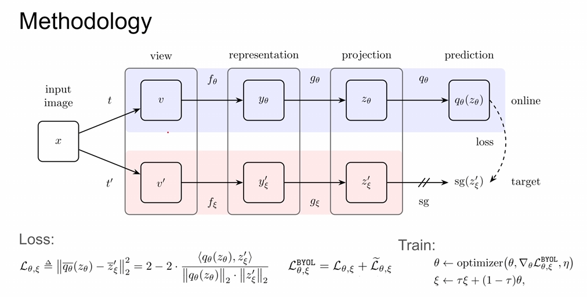
训练的时候需要使online network不断逼近target network，其中t表示图像增强策略，f表示encoder，g表示projection

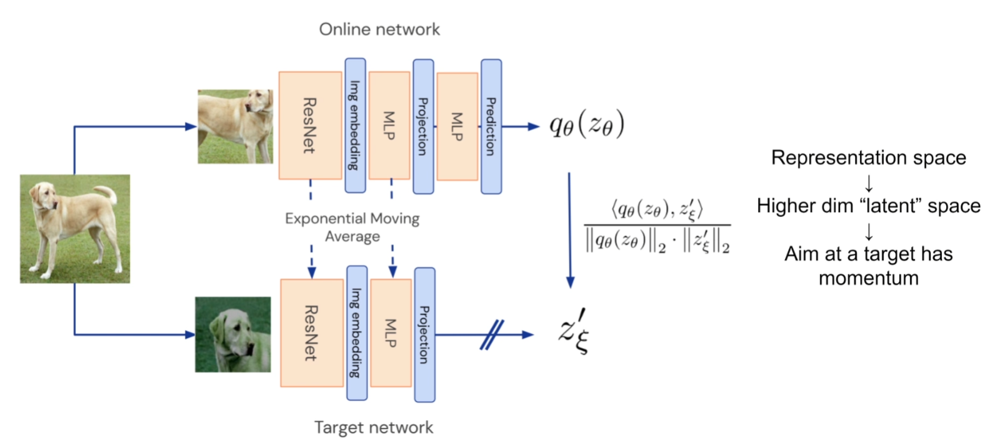
**为什么BYOL没有使用负样本和contrastive loss但是没有造成模型坍塌并且依然work呢？作者提到同一张图像在经过数据增强两次之后从encoder得到representation其实是关联性不大的，需要再经过一层MLP这种projection投影到更高维的latent space里面，在这个更高维的空间里面再经过contrastive learning使得两个vector有一定的空间关系，例如 尽可能靠近。**

显而易见的是，在online network里面经过projection层之后还有一层多的MLP层进行投影，这是因为毕竟这一张图片是经过两个不同的增强方式和网络(仅参数)，所以也不可能做到在projection空间中是完全相同的位置，因此需要再通过几层MLP把online network里面的vetor投影到target network。 

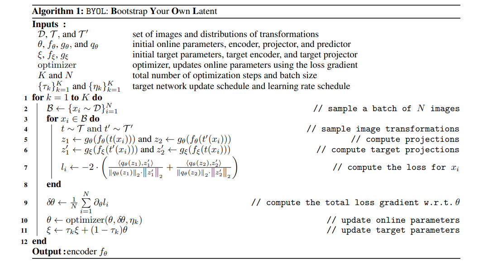

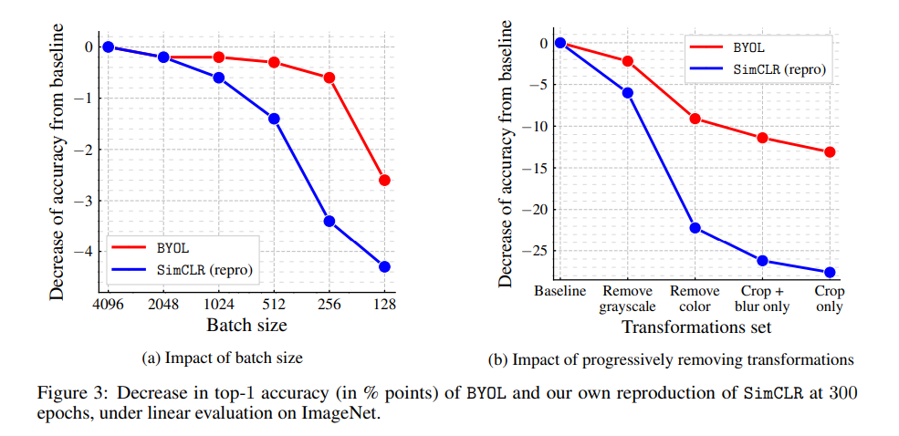
由于本文是没有通过负样本进行学习的，所以像SimCLR那种需要负样本的对比学习会对batch size更加敏感。但是**对比学习通常是会对batch size和optimizer比较敏感的**。

## Exploring Simple Siamese Representation Learning
#### 论文地址:https://arxiv.org/abs/2011.10566
#### 非官方代码:https://github.com/PatrickHua/SimSiam
本文一大特色就是"一切从简"：没有使用负样本，没有用大的batch size，也没有用momentum encoder，但是依然能够防止模型坍塌从而达到一个不错的结果。

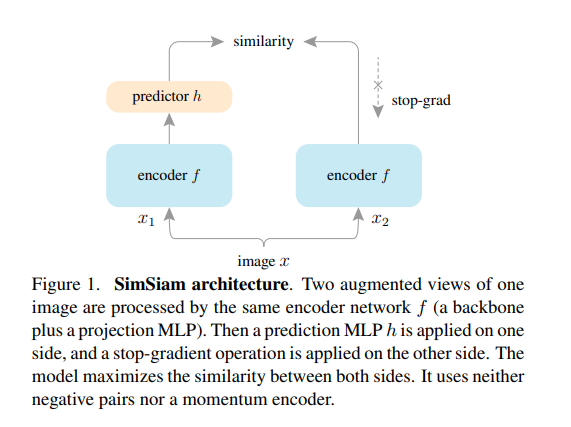
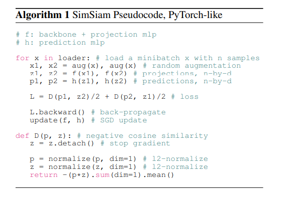
本文这里两个encoder直接使用相同的权重，并且把BYOL中的encoder和projection合在一起(本文是CNN(encoder)+多层MLP(projection)的结构)，但是predictor依然保留

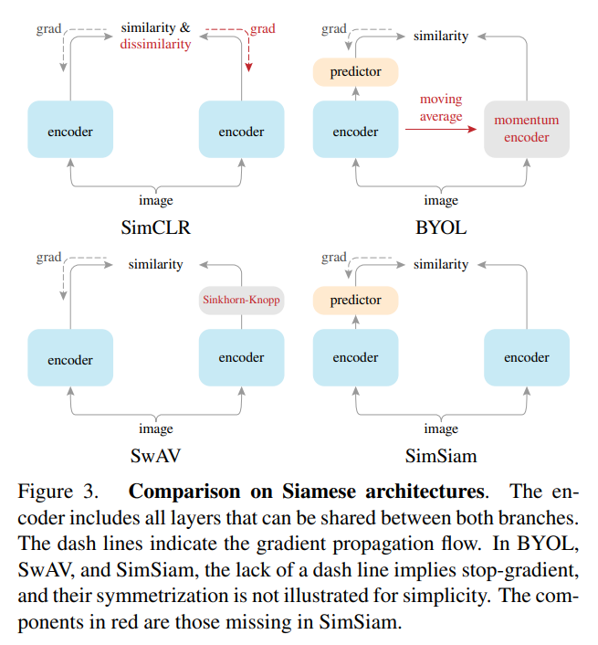
SimCLR是使用经典的contrastive的方法，通过正负样本对比进行梯度回传
BYOL是通过momentum

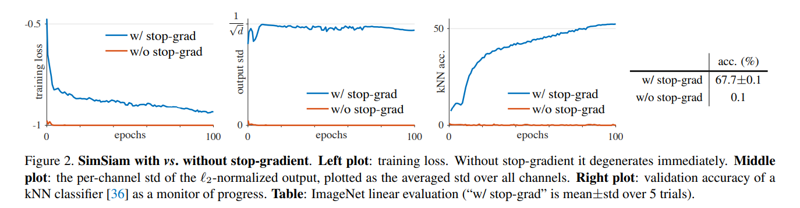
使用了stop-grad(停止一侧网络传递loss)则很容易使得两个网络的参数一致造成网络坍塌

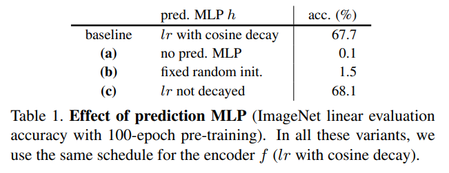
predicator有用

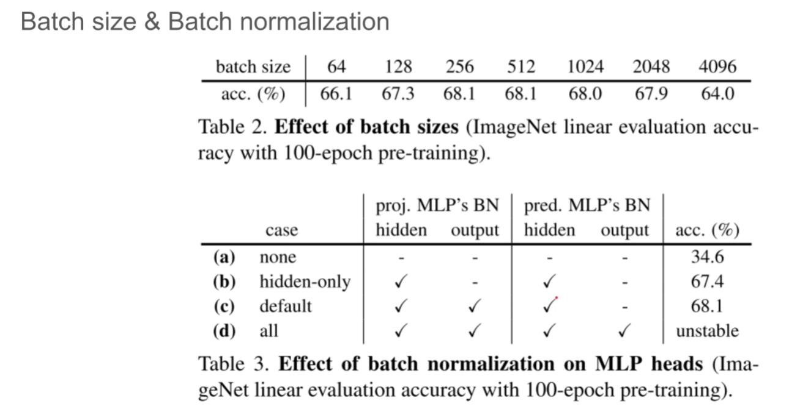
batch size的影响

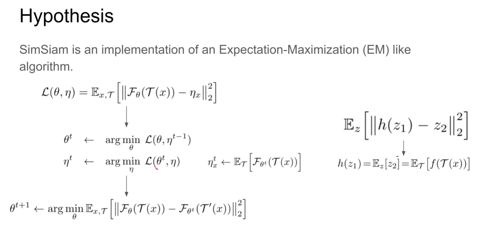
为何work，SimSiam类似一种最大期望算法，首先固定η训练一个θ使得loss达到最小，再把θ锁死训练η，这也可以解释为什么通常在对比学习里面孪生网络通常target network需要使用缓慢的momentum更新参数

