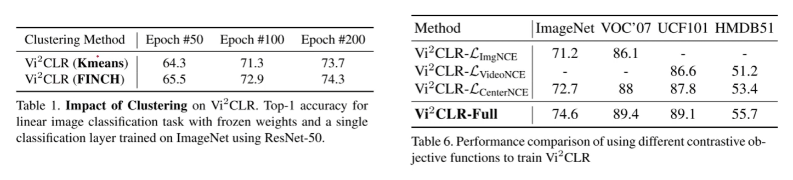

---

date: 2023-09-02
category:
  - 码头
tag:
  - 视频理解
  - 视频对话
---

# 关于视频理解的论文收集(较新)
本文可配合[视频理解综述性质记录](../videoUnderstanding/_videoUnderstanding.md)服用
## Swin Transformer: Hierarchical Vision Transformer using Shifted Windows
> 论文地址：http://arxiv.org/abs/2103.14030
  项目代码：https://github.com/microsoft/Swin-Transformer

通过与CNN相似的分层结构来处理图片，使得模型能够灵活处理不同尺度的图片

W-MAS 只在红框内做self-Attention，但显然易见的就是与其他的local window没有任何交流，因此patch之间没有信息传递
SW-MSA 如图Layer+1，同样是在红框内做attention，但是由于区域划分有所变化，能够与前一层的其他patch有信息传递。但如左上角的patch，划分后的区域太小，不够token的数量

## Is Space-Time Attention All You Need for Video Understanding?
> 论文地址：http://arxiv.org/abs/2102.05095
  项目代码：https://github.com/facebookresearch/TimeSformer

本文的Space-Time思想类似之前的工作[R(2+1)D](../videoUnderstanding/_videoUnderstanding.md/#r21da-closer-look-at-spatiotemporal-convolutions-for-action-recognition)：通过拆分时间和空间减少时间复杂度

上图的蓝色patch表示目前主要关注该帧该patch，其余颜色表示与蓝色patch的互动

从ViT很自然地可以想到，如果在时间维度上加上一个joint Space-Time Att就可以处理视频数据，但是这样的话随scequence的增加，其计算代价是呈指数形式增长的(视频稍微长一点，像素高一点的话，训练时的计算计算代价往往是难以承受的)。

由此可以先做一个方向的(先Time再Space)，但是作者发现交换了Time和Space的位置，甚至是两个batch分别做，不过效果不如现在的好

Divided Space-Time效果最好

## MViT: Multiscale Vision Transformers
> 论文地址：http://arxiv.org/abs/2104.11227
  项目代码：https://github.com/facebookresearch/SlowFast

Swin Transformer的后续工作，通过构建不同尺度的transformer实现各种下游任务的性能提升。相较于Swim Transformer，该工作关注点更多在于处理视频方面，并且更加generalize

作者在没减少4倍大小的情况下会增加2倍的channel

## VATT: Transformers for Multimodal Self-Supervised Learning from Raw Video, Audio and Text
> 论文地址：http://arxiv.org/abs/2104.11178
  项目代码：https://github.com/google-research/google-research/tree/master/vatt

作者认为视频、音频、文本描述之间的有很大联系的，例如看到汽车就能想到引擎的轰鸣声和行驶的风噪声。本文一开始的思路就是将三个模态的信号做成小的patch(sequence，然后投成embedding扔到transformer里面，再做projection投入相同的latent space里面最后做后续的下游任务 ，本文大致就是大力出奇迹的效果
具体是如何将视频、音频信号变成embedding输入到transformer呢，视频可以理解成一个一个cube + Temporal enc + Spatial enc 按照时间或空间切成小的patch通过linear projection投到一个vector里面；音频就直接切成一段一段再通过linear projection投影就行。由此就可以得到对应的embedding vector。但在本文中，文本的处理是通过one-hot进行投影的。
特别的是，本文提出Modality-Specific:3 Trs和Modality-Agnostic:1 Tr分别通过三个tansformer模块和一个去学习表征(实验证明还是分开用不同的transformer效果比较好)，但由于video维度非常高，切块之后的得到token数量太多，这样会导致训练的时间和需要的显存也就是计算资源需求会很大。要解决这一问题作者提出DropToken，核心思想和Dropout差不多，也就是随机去掉一些input token(一般是50%)，以此解决高分辨率原始数据的问题。
文章里面提到一个小的trick：因为video和audio是贯穿整个视频的，因此这两个模态之间的对齐比较简单，直接使用NCE Loss即可；但是video和text，由于文本会比较稀疏，作者在此采用MIL-NCE，大致思想就是即使video当前时刻没有文本，但是也可以通过该时刻前后的文本作为正样本解决文本稀疏/对应不上的问题

如果用相同结构的tansformer但是通过用一个distillation做信息交互会不会有搞头

## SlowFast Networks for Video Recognition
> 论文地址：http://arxiv.org/abs/1812.03982
  项目代码：https://github.com/facebookresearch/SlowFast

本文研究动机是人体的视觉系统有p(80%)、m两种细胞，分别处理静态的场景信息和高频的运动信息。因此作者提出一种通用做视频识别的框架，简单来说就是用两个path：一个以较低的频率处理视频语义信息，另一个以较高的频率处理运动信息，最后将二者合并。

Slow pathway：以较低的频率提取一个庞大的、深的网络处理空间语义信息
Fast pathway：高频率地通过浅的网络处理运动信息

以Slow pathway为例(每16帧取一张图片，fast是每2帧)，知道res4这一层，前面的所有层都是不处理时间轴的信息，作者认为时间轴的信息水太深了，前面几层浅层network把握不住，因此只在最后基层加上时间轴的信息做3D的conv。不过由于Fast需要捕捉运动信息，因此在一开始就需要加上时间轴的数据

1：直接拼接   2：直接采一个样本  3：遇事不决直接3D Conv

其中最右边，即使将Slow path处理的帧率提升一倍其性能也比不上Slow-Fast的组合，说明该结论确实有效。并且添加一个Fast path在没有加大多少计算难度的情况下均有不错的性能提升(2%起跳)

说明由于Fast path处理的是运动信息，因此把其转换成灰度、光流或者直接把图像缩小一倍，其性能也大差不差

## X3D: Expanding Architectures for Efficient Video Recognition
> 论文地址：http://arxiv.org/abs/2004.04730
  项目代码：https://github.com/facebookresearch/SlowFast

核心思想就是从一个小的2D image classification开始将模型扩大，最后让它变成一个高效的视频理解、动作识别等的网络结构

帧率扩充，帧率增加，分辨率，...

随着模型增大，regularzation也需要变强，并且之后甚至batch size也要调整(太花活了，整不来)

## Self-supervised Video Transformer
> 论文地址：https://arxiv.org/abs/2112.01514
  项目代码：https://github.com/kahnchana/svt

本文属于填空题性质的文章，将之前成熟的技术结合起来放在空白领域上的一种应用。如MOCO提出大型的memory bank(后已取消)，或那些无负样本学习的策略(能够减少Batch size大小，提高普适性)，该类对比学习之间的区别一个很大的重点在于如何构建loss(是否使用负样本、如何衡量representaion之间的距离、如何确定positive sample)，例如 nnclr(with little help with my friends)。

之间对比学习应用在图像上的时候，无非就是通过一些数据增强构建正样本对，但是在视频上由于多了时间维度，那么可操作空间就大很多了

这篇论文本身所有的正样本对都来自于一个视频的各个片段

teacher模型通过EMA(加权平均)的方式更新梯度

## With a Little Help from My Friends: Nearest-Neighbor Contrastive Learning of Visual Representations
> 论文地址：http://arxiv.org/abs/2104.14548

本文的关键思想在于通过NNs这个最近邻的过程能够选择一个更加generalize的data augment的过程。因为通过这种强行将另一张图像的representation视作为这张图像的representation，一方面相当于做了更加generalize的data augment，另一方面虽然另一张图片也是通过data augment但是不至于太离谱

## Solving Inefficiency of Self-supervised Representation Learning
> 论文地址：http://arxiv.org/abs/2104.08760
  项目代码：https://github.com/wanggrun/triplet

作者认为一般来说提供positive和negative的sample数量是非常不平衡的，也就很容易导致over cluster的现象

核心思想就是只区分最近的negative(hardest)， 但这样就会导致一个问题：会误认为positive sample是negative的

直接往后看几位，解决了痛击友军的问题

## VideoMoCo: Contrastive Video Representation Learning with Temporally Adversarial Examples
> 论文地址：http://arxiv.org/abs/2103.05905
  项目代码：https://github.com/tinapan-pt/VideoMoCo

核心贡献：1.Temporally Adversarial Learning    2.Temporal Decay

Generator通过LSTM产生一个每一帧的重要性分数，再通过Drop out丢弃关键帧。混淆Discriminator判别出不是同一个视频的误判，从而形成对抗
换种角度理解就是模型在搜索一种好的data augmentation去帮助representation learning学到好的表征。
(现在网络结构、loss有点卷不大动了，大家都把目光放在通过对抗学习去解决data augment的问题上了)

摒弃之前FIFO的思想，通过一个系数减弱先前的样本影响因子

## ExtreMA: Extreme Masking for Learning Instance and Distributed Visual Representations
> 论文地址：http://arxiv.org/abs/2206.04667

这篇是一个组合性质的paper，大致就是把masking，MAE，BERT和对比学习结合在一起的工作，整体结构是类似BYOL

但是本文在mask的时候是mask掉大部分，只把剩下的结构放进transformer里面，这样的话相应的梯度计算量就减少了，同时这种random masking可以视为一种好的data augmentation能够提供一种相互独立并且互补的patch。
并且由于online network传梯度但是target network不传递，相当于是把小的patch拉向这个整个patch的一个集合

## Broaden Your Views for Self-Supervised Video Learning
> 论文地址：http://arxiv.org/abs/2103.16559

与之前的video moco的drop frame不同，本文是通过narrow view(时间较短的clips)和broad view(时间长的clips)

作者通过实验发现如图的配置是最好的(有些模块参数是相同的，有些是不同的)，也就是说projector和predicator共享是能取到最好性能的

不可用syncing(同一时间点开始)，如果这样做的话，从narrow到broad就是一个简单的预测任务，而从broad到narrow就仅需要去掉一些帧就可以了

## Learning by Aligning Videos in Time
> 论文地址：http://arxiv.org/abs/2103.17260

将两个视频有相同语义信息的一帧在embedding space应该尽量接近

D就是两个视频各帧的embedding的第二范式距离,由于min操作不能得到梯度，那通过soft操作使得梯度得以计算

如果只有DTW，那么模型直接把所有视频都映射到一个embedding不就直接得到一个很低的loss然后坍塌了，因此需要IDM(对于每个视频序列单独加的一个loss)
W的意义在于，如果视频的两帧图像在时间序列上差距越远，那么在计算权重上就应该越小
但这个loss仍然有缺陷，因为需要maxmize I(X)，也就是说如果我不管W，直接所有的S(X)取非常大不就又是一个shotcut了吗

本文提出一个contrastive的idea，也就是通过一个windows size阈值，取5(时间比较近)，6(时间比较远)其中一个loss
note：公式7这个loss没有考虑由于视频时间长使得loss会增加，实际上应该还需调整

## Vi2CLR: Video and Image for Visual Contrastive Learning of Representation
> 论文地址：https://ieeexplore.ieee.org/abstract/document/9710567

本文一个亮点就是将video representation和image representation串接起来然后送到一个MLP里面得到一个新的joint representation ，再通过聚类的思想得到正负样本

注意通过FINCH聚类的方法要比Kmeans效果好

## VIOLET : End-to-End Video-Language Transformers with Masked Visual-token Modeling
> 论文地址：http://arxiv.org/abs/2111.12681
  项目代码：https://github.com/tsujuifu/pytorch_violet

这篇文章就是把mask、bert这些技术放到video和language共同训练的模型上，并且灵活地运用了transformers

pra-train部分通过MLM和MVM训练，再做两个下游任务：video QA和Text-Video Retrieval

模型需要预测，mask掉的patch和文字

dVAE：每一个token对应字典里面一个feature，仅需要预测出来字典里面对应的index即可

## BEVT: BERT Pretraining of Video Transformers
> 论文地址：http://arxiv.org/abs/2112.01529
  项目代码：https://github.com/xyzforever/BEVT.

对于视频无非就是得到Spatial representation和Temporal dynamics，该文章通过mask掉图像和视频两个分支进行image stream和video stream两个流去预测原始的图像和视频，具体来说是预测原始的embedding

本文是先用一个训练好的tokenizer(VQ-VAE)得到一个个token，最终是需要预测这些token而非像素。
区别于BERT，本文是选取blockwise的mask(如果mask掉的比例不够，继续选择一个新的block进行mask，直到mask的面积达到期望要求)，扩展到视频层面就是整个一个tube都被mask掉了。
(本文中，image encoder和video encoder的参数是共享的)

本文一个有意思的实验就是通过将视频所有帧都用同一帧代替/打乱时间线上的顺序，验证了本模型能够理解视频上下文的能力

## TransRank: Self-supervised Video Representation Learning via Ranking-based Transformation Recognition
> 论文地址：http://arxiv.org/abs/2205.02028
  项目代码：https://github.com/kennymckormick/TransRank （暂未上传）

一般来说这种self-supervise模型需要通过一个比较好的task来辅助模型学到representation。(例如这个SpeedNet通过模型来判断视频是否被加速来学习视频的表征、3D-RotNet将视频旋转再通过classifi而判断)，另一种方法就是通过contrastive learning通过instance discrimination来学习表征

这种hinge loss能够帮助模型做排序任务

(需要精读)

## Probabilistic Representations for Video Contrastive Learning: ProViCo
> 论文地址：http://arxiv.org/abs/2204.03946

本文通过contrastive learning处理video，特别的是其中的representation不是一个确定的representation而是一个概率的形式。
作者提出一个问题，Contrastive Learning是通过将正、负样本学习representation，常见的在video的操作就是将同一个视频里截取出来几个clip作为正样本，其他视频截取的clip作为负样本，但是假设两个视频里面截取出来的clip分别包含抬胳膊、挥手两个不同的动作，由于是从不同的视频里面截取的理应是不同的类别(一对正负样本)，然而在两个clip中均包含抬手臂的动作，那么将这种clip强行区分成正负样本会导致encoder confused。

首先将两个video进行随机采样得到多个clip，再通过一个概率的embedding得到整个视频的representation，然后从这个representation中重新采样得到真实的clip表征，那么接下来就是考虑如何确定正负样本的过程了

值得注意的是 本文作者用的是巴氏距离而不是MSE

由于每个clip提取的时候是符合高斯分布的，因此最后得到的representation也需要符合高斯分布