---

date: 2023-10-09
category:
  - 码头
tag:
  - 视频理解
  - 视频对话
---

# 视频理解综述性质的记录

## 简介
视频数据本身就是一种多模态信息，并且是一种很丰富的数据来源，其包含的信息远远多于2D的图片，例如有物体移动的信息，以及长期的时序信息，音频信号等，并且视频数据是一种天生的数据增强，比如在一段视频中一个物体会有各种各样的变化，形变，遮挡，光照变化等，这种改变通常是十分丰富且自由的，远比通过一些图片处理得到的数据增强要自然的多。视频理解领域三巨头就是：Action Recognition、Temporal Action Localization、Spatio-Temporal Action Localization

:::tip
考虑一下从视频当中设定一些自监督信号
:::

视频理解领域发展大致如下：**双流网络——TSN——I3D——SlowFast——TimeSformer**

:::details
DeepVideo ([Large-scale Video Classification with Convolutional Neural Networks](https://cs.stanford.edu/people/karpathy/deepvideo/))
> 提出sports1M数据集，用深度学习做视频理解

双流网络 ([Two-Stream Convolutional Networks for Action Recognition in Videos](https://arxiv.org/abs/1406.2199))
> 引入光流做时序建模，神经网络首次超越手工特征

C3D ([Learning Spatiotemporal Features with 3D Convolutional Networks](https://arxiv.org/abs/1412.0767))
> 比较深的3D-CNN做视频理解

Beyond-short-snippets ([Beyond Short Snippets: Deep Networks for Video Classification](https://arxiv.org/abs/1503.08909))
> 尝试使用LSTM

Convolutional fusion ([Beyond Short Snippets: Deep Networks for Video Classification](https://arxiv.org/abs/1604.06573)) 
> 做early fusion来加强时空间建模

TSN ([Convolutional Two-Stream Network Fusion for Video Action Recognition](https://arxiv.org/abs/1608.00859))
> 超级有效的视频分段建模，bag of tricks in video

I3D ([Quo Vadis, Action Recognition? A New Model and the Kinetics Dataset](https://arxiv.org/abs/1705.07750))
> 提出Kinetics数据集，膨胀2D网络到3D，开启3D-CNN时代

R2+1D ([A Closer Look at Spatiotemporal Convolutions for Action Recognition](https://arxiv.org/abs/1711.11248))
> 拆分3D卷积核，使3D网络容易优化

Non-local ([Non-local Neural Networks](https://arxiv.org/abs/1711.07971))
> 引入自注意力做视觉问题

SlowFast ([SlowFast Networks for Video Recognition](https://arxiv.org/abs/1812.03982))
> 快慢两支路提升效率

TimeSformer ([Is Space-Time Attention All You Need for Video Understanding?](https://arxiv.org/abs/2102.05095))
> 视频中第一个引入transformer，开启video transformer时代
:::

## DeepVideo：Large-scale Video Classification with Convolutional Neural Networks
> 论文地址：https://cs.stanford.edu/people/karpathy/deepvideo/

本文属于最早期的通过深度学习方法处理视频模态的信息，其想法是比较直接的：就是如何把图片识别应用到视频识别里面。视频比图片多一个时间维度，因此需要考虑几个变体来适应视频信息的输入
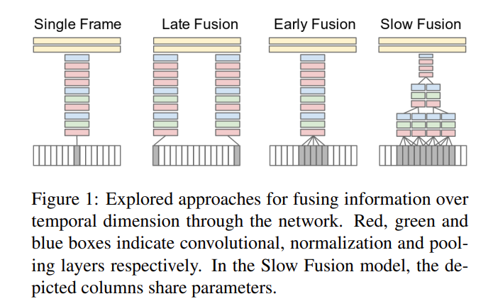

1. **Single Frame**：其实这种方式就是图片分类的任务，就是取其中一帧通过CNN网络得到特征(但事实上后续也有实验证明只要取得一帧关键帧里面的信息就可以在很多任务上得出不错的结果，所以目前也有很多网络其实并未很好的学习到视频里面的时序信息)，这种方法相当于一种baseline，也就是完全没有用到时序信息

2. **Late Fusion**：选取视频几帧作为输入，最后分别通过CNN(通常是权值共享的)得到特征最后把这些得到的特征进行融合，虽然做法上还是类似图片分类，但是最后有fusion操作所以稍微有利用到一点时序信息

3. **Early Fusion**：此处采取的是十分暴力的融和方法，直接把n帧视频帧在rgb通道上进行融合，也就是说本来是 h × w × 3 的图片变成 h × w × 3n

4. **Slow Fusion**：相当于2+3,效果较强于前面几种方法，但是也大差不差。

值得注意的是，上面几种方法其实不如原始的手工选取特征(多么痛的领悟)。

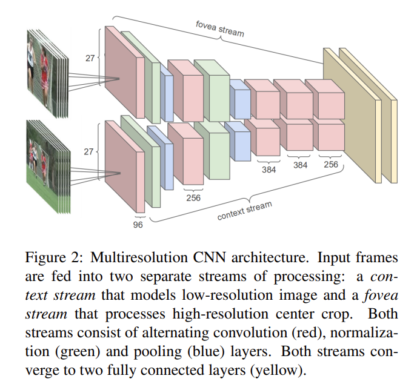

该方法是采取一种多分辨率的结构，也就是说一边输入的是完整的视频，一边输入的是从视频正中间扣出来的小框得到的视频。

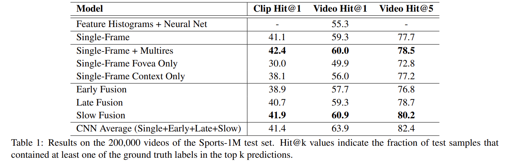

Late Fusion、Early Fusion的实验结果都不如baseline，只有Slow Fusion经过一顿操作之后勉强比Single Frame性能高一点点。而且其实在UCF-101上的结果显示，最好的Slow Fusion性能仅65%而通过手工选取特征的结果也有87%。但**本文的主要贡献在于提出了一个新的数据集，并且把从CNN处理图片的方式直观地运用到视频领域，起了抛砖引玉的作用**。

## 双流网络：Two-Stream Convolutional Networks for Action Recognition in Videos (2014)
> 论文地址：https://arxiv.org/abs/1406.2199

双流网络，故名思意就是用两个卷积神经网络做有关video的动作识别分类

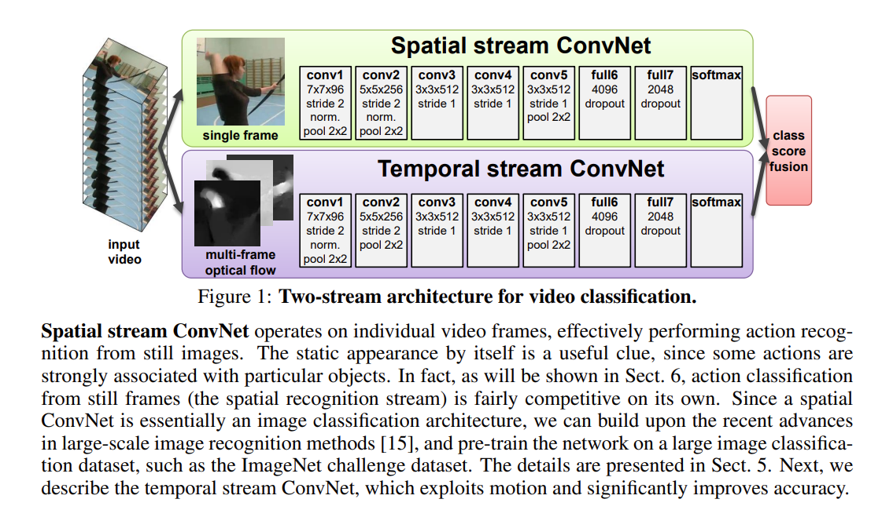

早期处理视频的方式就是：抽取一些关键帧，再通过conv，最后把结果合并起来；或者就是把一些帧叠起来当作一个整体的输入丢进神经网络，再在网络里面做一些early fusion或者late fusion达到一种时空学习的效果。但上面方法效果都差强人意，甚至达不到手工设置特征的效果，本文作者发现**卷积神经网络只能处理好一些局部的特征而不是视频中物体的运动规律**。因此本文通过先抽取motion-information(通过光流)到最后的动作映射实现对视频信息的处理。

上层叫做空间流卷积神经网络，下层关注motion-information的叫时间流卷积神经网络。两个网络分别输入单帧图片和光流图片，最后得到对应的分类概率，再通过加权平均得到最终的预测。
 
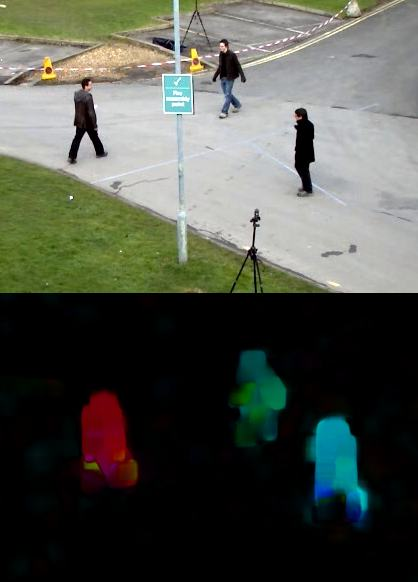

光流简要来说就是用来观测场景中运动物体的轨迹信息，物体在于上一帧的位置差距越大则颜色越明显，反正越黑。光流能够忽略背景噪声，从而完全关注动作本身。但是光流目前也比较受人诟病：例如计算光流需要时间很长，并且占用的硬盘空间比较大。

本文作者认为一些视觉信息(颜色，位置等)是可以通过CNN这种提取局部信息的网络得到，但是动作信息(光流部分)需要通过其他网络进行学习。并且作者提到即使在只有少量训练数据的情况下一个直接在光流训练数据上训练的网络也有一个不错的结果，**因此其实某种意义来本文提升性能的关键在于光流数据的使用**

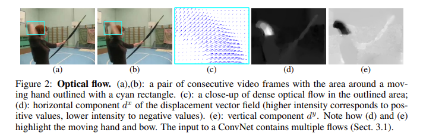

图片里面每个像素点都对应一个光流点，并且光流一般维度为 H × W × 2,最后一个维度通常是 水平上(运动) 和 垂直上，并且两帧图片之间得到一个光流图，也就是说L帧的视频能够得到L-1张光流图。

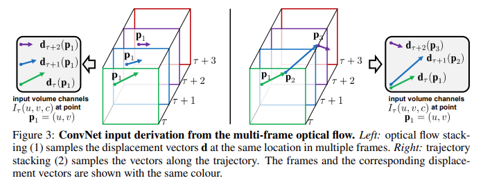

左：直接把所有的光流图叠加在一起，这种方式的好处就是比较简单，没有多余的处理工作，但是没有充分的利用到光流信息

右：在光流的轨迹上进行光流数值的叠加，也就是说在第一张图的P1已经在下一张图运动到P2的时候，就在第二图里从P2找下一张图P2运动终点的位置。(虽然右边方法比左边要合理，可是本文最后实验证明左边的方式效果比右边的好)

**不过作者同样做了Bi-directional操作，因为倒放也是合理的(笑)，并且一般来说这种双向操作都是可以涨点的(起码不会掉点)，例如BERT、pyramid、cascade里面类似**

未来工作：
1. 本文在空间流上使用了预训练模型，那么处理光流数据的时间流是否同样可以通过预训练网络得到更好的结果
2. 基于轨迹叠加光流数据的方法按理来说效果应该更好，但是在本文的实验中并未显示出来它的优势
3. 视频里面通常带有camera-motion，也就是说相机自带的移动会影响光流里面物体运动信息的计算，也就是说如何避免这种全局的影响(本文使用的是直接减去一个平均)
4. 能否直接做early fusion，或者其他复杂的late fusion，本文仅是加权平均。
5. 按理来说LSTM能很好的处理时序信息的，那么把一张张视频帧通过CNN得到特征之后再进入LSTM学习，最后得到特征应该会更强
6. 长时间的视频理解，而非本文中取10帧光流(0.5s左右)，因为一般来说一个动作时间大概在2-3秒左右

## Beyond-short-snippets：Beyond Short Snippets: Deep Networks for Video Classification
> 论文地址：https://arxiv.org/abs/1503.08909

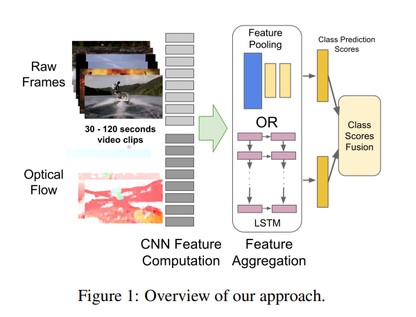

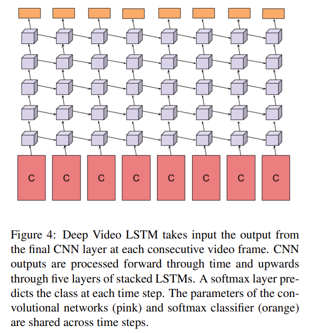

本文通过LSTM进一步处理从CNN里面提取出的特征，其效果理应得到进一步提升，但是从实验结果看来提升的幅度十分有限。

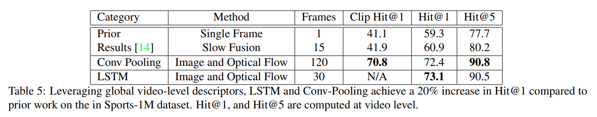

虽然看似实验结果比之前好不少，但是其实主要贡献来自于使用了光流而非LSTM

::: tip
LSTM更加适合具有变化的输入，这样LSTM才能起到学习语义信息的作用，像是这种六七秒的视频可能本身就没有语义信息的改变，这样就相当于把很多一摸一样的输入传递给LSTM，也就根本学不出个东西出来，所以在本文里面效果一般
:::

## Convolutional fusion：Beyond Short Snippets: Deep Networks for Video Classification
> 论文地址：https://arxiv.org/abs/1503.08909

本文主要讲述当有了这种视频帧(空间流)+光流(时间流)的输入之后应该如何做fusion

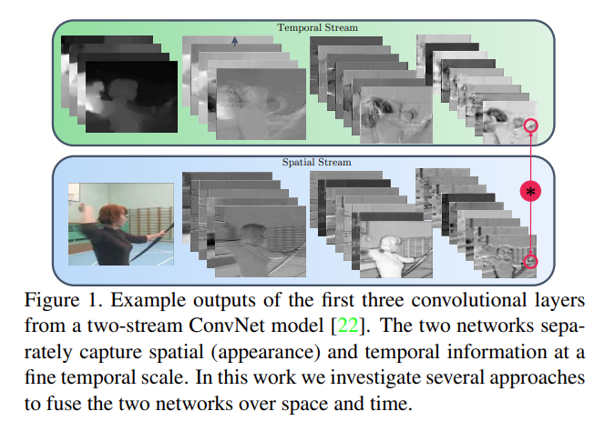

1. Spatial fusion：作者的用意是想确定，当有了时间流和空间流两个网络之后如何保证这两个流的特征图能够在同样的位置上产生的通道response是差不多能够联系起来的，也就是说在特征图层面就做一个fusion(early fusion)
> 例如：max fusion：在a(空间流)，b(时间流)的特征图中各个像素位置点上取max；
  concatenation fusion：直接合并就完事；
  conv fusion：先把a，b堆叠起来，再做一层卷积操作；
  sum fusion：直接对应位置做加法；
  Bilinear fusion：在a，b上做一个out product，乘积之后再在所有维度上取一个加权平均；

2. Temporal fusion：当有很多视频帧，每一帧抽得特征之后，如何在时间轴维度上把它们合并起来。本文采取两种方式：3D Pooling和3D Conv + 3D pooling

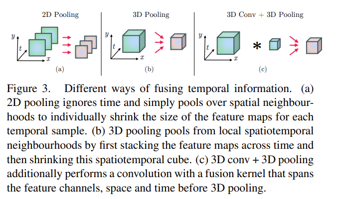

3. 何时fusion：作者经过大量消融实验得到两种比较好的方式，也就是下图所示。

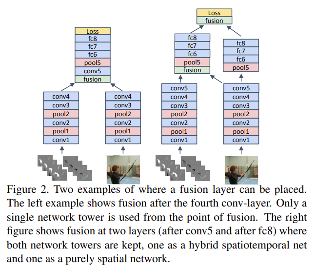

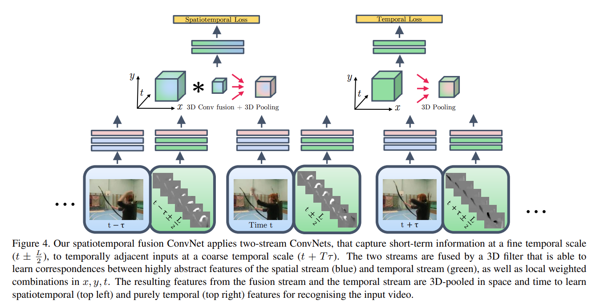

蓝色代表空间流，绿色代表时间流。

从框架图里面可以看出，本文先是做了一个spatialtemporal branch然后再专门地做了temporal branch，其原因在于之前的双流网络也发现了视频领域里面这种时间学习是很有必要的。不过在推理的时候其实还是和双流网络一样，两个branch通过一个加权平均做late fusion最后得到分类结果

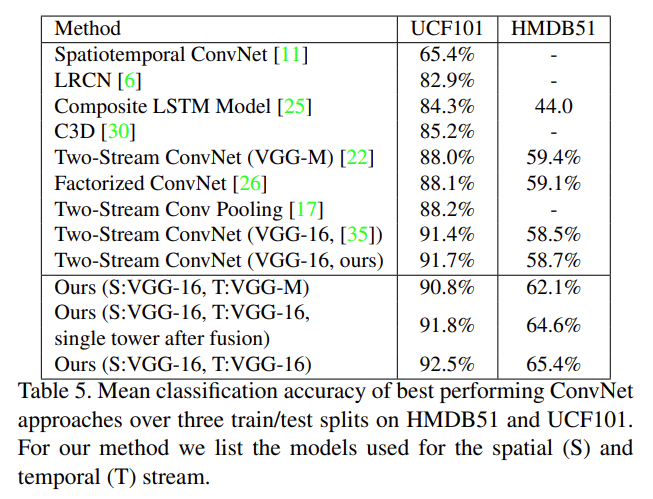

本文将双流网络中原始网络替换成VGG-16(更深)后在UCF上有所提升(3个多点)，但在HMDB51上略微有所下降(2个点)。**其实很大程度的原因就是当一个数据集特别小的时候，但是要用比较深的网络进行训练的时候就容易造成过拟合的问题**，所以其实不见得用容量更大的、更深的网络就能得到更好的结果。

不过呢，本文提出的方法虽然在UCF上有所提升(0.8个多点)，但在HMDB51上提升确实十分明显(近7个点)，说明这种early fusion可能算是一种变相的对网络的约束，让模型早期训练中能够先一步将空间流和时间流的特征相互弥补相互学习。

## TSN：Convolutional Two-Stream Network Fusion for Video Action Recognition
> 论文地址：https://arxiv.org/abs/1608.00859
  项目仓库：https://github.com/ZJCV/TSN (非官方)

本文主要贡献在于通过一种特别简单的方式处理长时间的视频，而且效果很好。**还有一大贡献就是确定了很多好用的技巧，后续工作可以利用好这些trick**，例如怎么做数据增强、怎么做模型的初始化、怎么使用光流、使用哪个网络、如何防止过拟合。

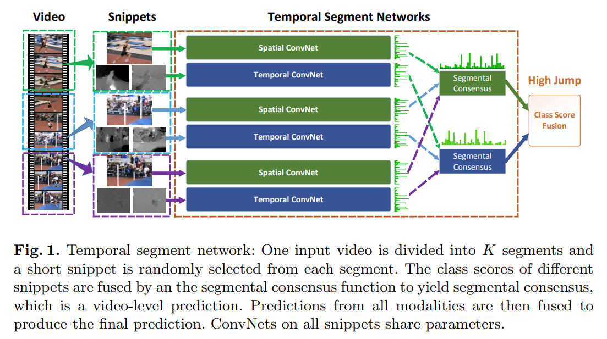

本文的想法也确实简单，长视频处理不了把它切成n段不就成了吗。每一段里面选取一帧并且以这一帧作为起点得到光流图，再通过双流网络往下做得到logits，其中spatial convnet是共享参数的，temporal convnet也是共享参数的。

TSN的想法就是，如果视频不太长，里面只有一个事件或者动作的话，即使抽出来的帧表面不大一样，但其实最高层的语义信息应当是差不多的，所以空间流、时间流中的每段logits最后做一个segmental consensus(其实也是某种意义上的fusion，具体操作可以做加法、乘法、max、average，复杂的话也可用MLP,LSTM等)
最后做一个late fusion(加权平均)得到最终分类结果。

文章提及的trick部分：
1. cross-modality pre-training：作者把video和光流看做是两个不同的模态(倒也是)，但是在光流部分是没有一个足够大的数据集去做预训练的。在此，作者提出直接用Image-Net上预训练的模型来处理光流是能够很好的接受其信息的，不过需要在网络上把第一层conv修改一下结构和参数(Image-Net输入是rgb图像，也就是3个channel。光流图却是一次性输入10张光流图，x、y方向的位移共2个channel，也就是总共20个channel)。具体操作也是十分简单，直接把3个channel的参数做了平均，然后复制20遍。
2. 通过Batch Normalization做一个模型的正则化：对于数据集小的task来说，使用BN虽然能够加速训练，但是也容易造成过拟合的问题。文本提出一种partial BN，具体来说就是第一层BN全打开，后面的BN层全冻住，这样做的意义就是因为输入变了(预训练模型输入是image，而现在是video和光流)所以第一层必须要学一学(某种意义上是一种跨模态对齐？)。**对于一些小数据集的下游任务应该是十分有用的(没错 说的就是AVSD)**
3. data augmentation：本文重点提到corner cropping和scale-jittering，做corner cropping的理由就是如果是random cropping其实很难裁剪到video里面边边角角的地方，通常是截取到中间位置；而scale-jittering也就是改变视频长宽比增加输入图片的多样性

## C3D：Learning Spatiotemporal Features with 3D Convolutional Networks
> 论文地址：https://arxiv.org/abs/1412.0767

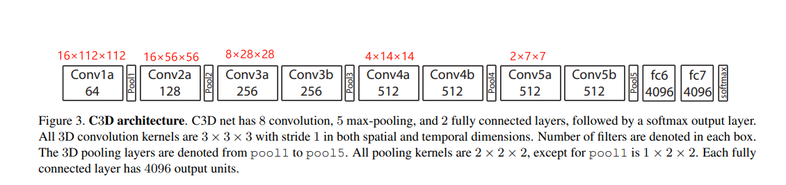

其实C3D相当于把vgg里面每个block去掉一层conv层再把卷积核变成3D的，但是在本文里作者发现微调这个网络费时费力，不如直接用fc6抽出来的特征再训练一个SVM分类器，本文C3D一半特指fc6中提取出来的特征

## I3D：Quo Vadis, Action Recognition? A New Model and the Kinetics Dataset
> 论文地址：https://arxiv.org/abs/1705.07750
  项目仓库：https://github.com/google-deepmind/kinetics-i3d

本文一大亮点就是将2D的一些网络扩张(inflated)到3D，其次就是新的数据集。但其实kinetics还是很special heavy，也就是说取视频最中间那一帧，仅用这一帧做图像分类，也可以取得不错的结果，不大需要完整的上下文信息和模型的时序能力。但是其实事实上，至今为止也没有一个数据集能说让模型真的能关注到时序上的信息，或者说是能够处理时间长的、复杂的视频，也难以扩展到生活中各个方面上去。

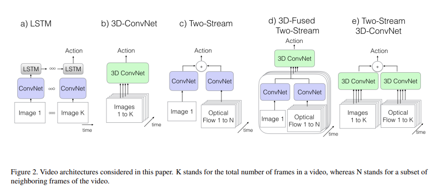

过去常见视频理解领域的处理方法就是：
1. CNN + LSTM：CNN抽取特征，LSTM用来处理时序信息
2. 直接训练3D网络
3. 双流网络

因此作者提出：
4. **双流I3D (目前大多数视频领域下游任务抽取出来的特征都是用本文提出的网络得到的)**
note：后续很多实验证明，先做2D CNN最后再做3D CNN效果比较好。

UCF-101和HMDB-51差不多是13000、7000多个视频，可见数量是十分之少的，其实是很难发挥出深度学习的作用的。**因此如果需要在AVSD上取得好的结果肯定是需要其他预训练网络的结果再做微调**
本文里面提出的扩张(inflated)也很容易理解，例如ResNET-50里面所有的3×3卷积或者pooling直接变成3×3×3(所谓的3D CNN)，这样的话就可以不用专门的去设计一个针对视频理解的网络架构。因为之前在做2D图片的时候，其实CNN网络架构已经做了很多消融实验了，包括怎么选取kernal size、网络应该分成几个阶段、或者一个阶段里面应该包含多少residual block等，基于前人的工作，最直观的想法就是直接套用2D里面的工作应用到视频领域，比较video也是一帧帧图片叠加起来的。
但是本文除了使用这种3D CNN以外其实还是用到了双流的结构，因为作者发现，仅仅扩张卷积核的维度最后效果也不会太好，因为毕竟卷积神经网络不擅长处理动作信息，因此还是需要时间流的网络进一步提高性能。
**目前其实视频领域没也有一个定论说到底2D、3D、transformer结构那种效果是最好的**

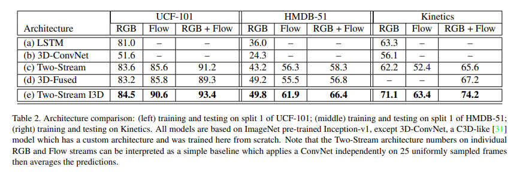

从图中可以看出，无论是时间流、空间流孰好孰坏，只要是把视频和光流结合到一起就会得到性能上的提升。**说明不管怎样，光流的数据都能给模型的性能带来提升**

## Non-local：Non-local Neural Networks
https://arxiv.org/abs/1711.07971
 项目代码：https://github.com/facebookresearch/video-nonlocal-net

Non-local这篇文章把自注意力机制引入到视频领域之后直接卷疯了，后续很多工作都是通过Non-local的算子做各种不同的网络、各种不同的变体。总体而言就是自注意力确实有效，本文主要是采取Non-local的思想，也就是希望模型关注更多的上下文信息而不是一个局部的信息，并且因为该模块是个即插即用的模块，所以能够用到各个下游任务里面，泛化性很好。

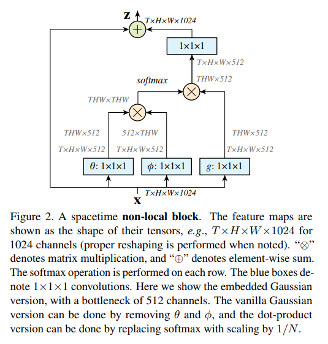

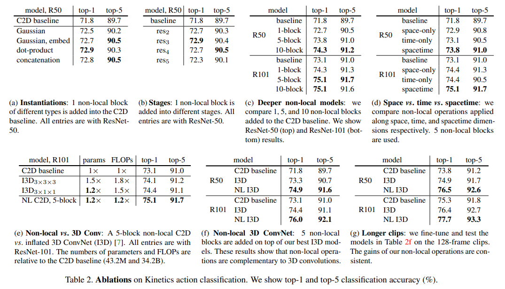

> (a) Non-local block中自注意力如何计算：dot-product效果最好，也是transformer里面默认的计算方式。
  (b) Non-local插在哪个block：res5层的时候可能由于特征图太小了，因此效果没那么好。
  (c) Non-local应该插多少个：R50的结构是3463，因此插10个就是在每个conv后面接一个Non-local。
  (d) Non-local在空间、时间、时空的对比：self-attention提出本来就是在特征图上处理的，因此可能就在space上面做attention就可以了，没有必要做space-time上的attention，不过结果显示时间、空间上一样重要，并且时空都做的话效果是最好的。 
  (g) Non-local能否在更长的视频里面表现更好，本文提出的动机就是希望能够处理这种上下文信息，如果只使用16/32帧(1秒)的话其实不大长也没什么长距离信息，因此作者通过输入128帧(4秒)的视频验证了Non-local确实对长距离的时序建模有好处的也能够抓住这种视频的上下文信息。

  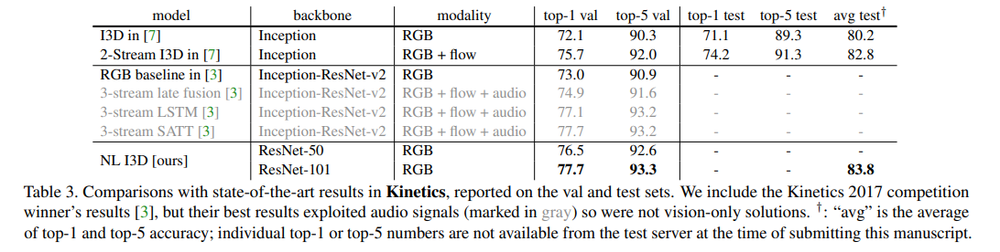
  
  本文的方法要好过之前用光流的方法，并且能够超过以Inception-ResNet这个更强的网络为骨干、用三个模态信息训练的网络 **(但是不证明光流效果不好，也许加上光流更好了呢)**，某种意义上也给那些处理不了光流数据的实验室一个做视频理解领域相关实验的机会。

## R(2+1)D：A Closer Look at Spatiotemporal Convolutions for Action Recognition
 > 论文地址：https://arxiv.org/abs/1711.11248

本文是一篇实验性的论文，主要是为了验证在动作识别这个task里面，时空卷积应该怎么去做，是2D还是3D，还是2D + 3D，是怎么组合，串联或是并联。简要来说作者发现把3D拆成空间上的3D和时间上的1D能够取得更好的效果，并且训练也会简单很多

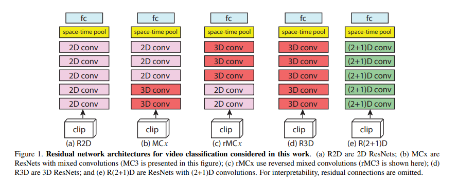

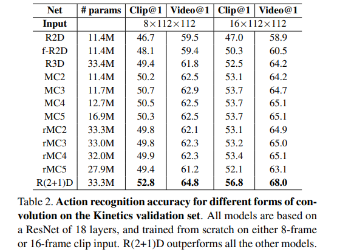

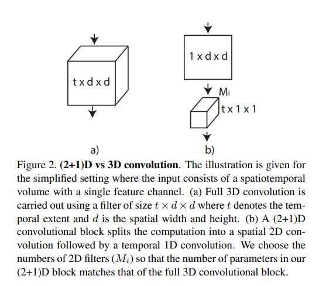

如图所示：简单来说就是空间上做1×d×d的卷积(时间上什么都不做)，然后做一个空间投射(目的是和C3D网络参数保持一致，最后做公平的性能对比)，最后做一个t×1×1的这样一个时间上的卷积。
:::tip
作者提出R(2+1)D的效果比C3D要好的原因就是：增强了网络的非线性，因为3D conv后面只有一个relu层，也就是只有一个非线性操作；现在做了两次卷积，后面有两个relu。
:::

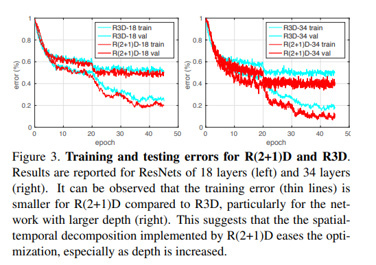

并且从训练角度，2D + 1D确实比3D的conv好学很多

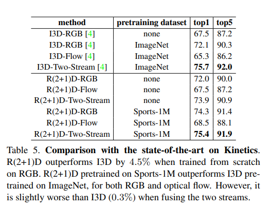

R(2+1)D效果在单独的RGB和flow上效果比i3d效果好，但是做了late fusion之后效果却没有I3D的效果好。(作者此处也没给出解释)
但是其实，R(2+1)D是用的112×112的输入，而I3D用的224×224。并且前者的训练过程相较于后者也确实有优化，能够降低过拟合。

## SlowFast Networks for Video Recognition
> 论文地址：http://arxiv.org/abs/1812.03982
  项目代码：https://github.com/facebookresearch/SlowFast

此篇介绍在[视频理解综述性质记录](../videoRepresentation/_videoRepresentation.md/#slowfast-networks-for-video-recognition)提及

## Is Space-Time Attention All You Need for Video Understanding?
> 论文地址：http://arxiv.org/abs/2102.05095
  项目代码：https://github.com/facebookresearch/TimeSformer

此篇介绍在[视频理解综述性质记录](../videoRepresentation/_videoRepresentation.md/#is-space-time-attention-all-you-need-for-video-understanding)提及