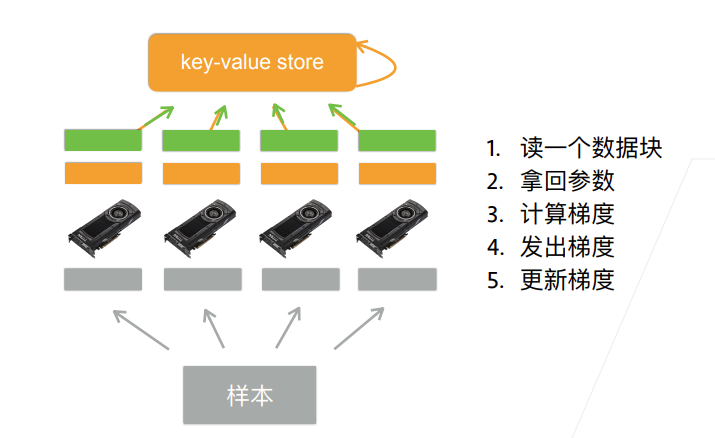

# Pytorch分布式训练
本文主要介绍DistributedDataParallel以及DataParallel并行的区别和DDP的原理、方法。

## 单机多卡并行

常用切分方案有：数据并行、模型并行、通道并行(数据+模型并行)

数据并行：将batch分成n块，每个GPU拿到完整参数计算一块数据的梯度，该方法通常性能更好

模型并行：将模型分成n块，每个GPU拿到一块模型计算其前向和方向结果，该方法通常适用于单GPU放不下大模型的情况，这就会导致整个计算过程是串行的，加大了性能优化难度

### DDP 与 DP 的区别

### DDP与DP的区别

 * DDP在DataLoader部分需要使用Sampler，保证不同GPU卡处理独立的子集.

* DDP在模型部分使用DistributedDataParallel.

* DP不能做BN同步，DDP可以

* DP存在负载不均衡的问题(主卡的显存占用大于其他卡，甚至远大于。有时主卡爆了而其他卡的显存还没到一半)，而DDP没有

    因为DP并不是完全的并行计算，只是数据在多张卡上并行计算，模型的保存和Loss的计算都是集中在几张卡中的一张上面，这也导致了多卡显存占用会不一致。

* DDP的速度要比DP更快

    DP 的通信成本随着 GPU 数量线性增长，而 DDP 支持 Ring AllReduce，其通信成本是恒定的，与 GPU 数量无关。

### DDP 多卡训练的原理
* 将模型在各个GPU上复制一份；

* 将总的batch数据等分到不同的GPU上进行计算(shuffle顺序打乱的)。每个进程都从磁盘加载其自己的数据

* 在模型训练时，损失函数的前向传播和计算在每个 GPU 上独立执行。因此，不需要收集网络输出。在反向传播期间，各个进程通过一种叫Ring-Reduce的方法与其他进程通讯，交换各自的梯度，从而获得所有进程的平均梯度；然后用这个值在所有GPU上执行梯度下降

从而每个 GPU 在反向传播结束时最终得到平均梯度的相同副本。

* 各个进程用平均后的梯度更新自己的参数，因为各个进程的初始参数、更新梯度是一致的，所以更新后的参数也是完全相同的。

    这里的汇总还是由rank=0的卡汇总平均，然后再广播到其他卡。至于为什么不只用其他卡和主卡通信而是其他卡之间也要通信，是因为用的是ring-reduce, 组成一个环形来作信息传递，在多卡的情形下更高效

DDP利用All-Reduce，来进行不同进程上的梯度的平均操作(Ring-Reduce是All-Reduce的一个实现版本)

不同卡之间只有梯度在通信。

在Pytorch中使用DDP
      DDP的官方最佳实践是，每个进程对应一张卡

      举个例子：我有两台机子，每台8张显卡，那就是2x8=16个进程，并行数是16。

但是，我们也是可以给每个进程分配多张卡的。总的来说，分为以下三种情况：

1. 每个进程一张卡。这是DDP的最佳使用方法。
2. 每个进程多张卡，复制模式。一个模型复制在不同卡上面，每个进程都实质等同于DP模式。这样做是能跑得通的，但是，速度不如上一种方法，一般不采用。
3. 每个进程多张卡，并行模式。一个模型的不同部分分布在不同的卡上面。例如，网络的前半部分在0号卡上，后半部分在1号卡上。这种场景，一般是因为我们的模型非常大，大到一张卡都塞不下batch size = 1的一个模型。
